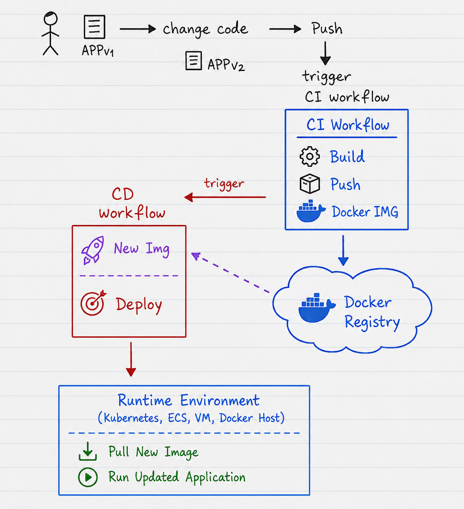

# Important Information About Continuous Deployment (CD) Using GitHub Actions

## What is Continuous Deployment (CD)?

Continuous Deployment (CD) is an automation process that automatically deploys a new application version to the runtime environment after a new artifact has been created.

In this example, the artifact is a Docker image that was built and pushed during the Continuous Integration (CI) process.

In other words:

```text
CI = Build and Push Docker Image
CD = Deploy the Docker Image
```

The basic idea:

```text
Developer updates code
→ Push to GitHub
→ CI builds and pushes a new Docker image to the Docker Registry
→ CD workflow runs automatically
→ Deployment tool or API updates the runtime environment
→ Runtime environment pulls the new Docker image
→ Updated application runs
```



---

## The Problem That CD Solves

Without CD, after CI pushes a new Docker image to the Docker Registry, you must manually update the runtime environment.

For example, you might need to manually:

1. Open the deployment platform.
2. Trigger a new deployment.
3. Wait for the platform to pull the new Docker image.
4. Verify that the updated application is running.

This process is repetitive and error-prone.

CD automates these steps.

---

## Practical Scenario

You have:

- Source Code
- Dockerfile
- GitHub Repository
- GitHub Actions
- Docker Registry (such as Docker Hub)
- Runtime Environment (such as Kubernetes, Amazon ECS, Azure Container Apps, or a Virtual Machine)

The CI workflow:

1. Builds a new Docker image.
2. Pushes the Docker image to the Docker Registry.

The CD workflow:

1. Detects that a new image is available.
2. Triggers a deployment.
3. Updates the runtime environment.
4. Starts the new application version.

---

## Relationship Between CI and CD

### Continuous Integration (CI)

CI is responsible for:

1. Retrieving the source code.
2. Building the application.
3. Running tests.
4. Creating an artifact (such as a Docker image).
5. Publishing the artifact to a registry or artifact repository.

### Continuous Deployment (CD)

CD is responsible for:

1. Retrieving the new artifact.
2. Deploying it to the runtime environment.
3. Updating the running application.

In short:

```text
CI = Build and Publish Artifact
CD = Deploy Artifact to Runtime Environment
```

---

## What is `cd.yml`?

The Continuous Deployment workflow is defined in the following file:

```text
.github/workflows/cd.yml
```

This file contains the instructions that GitHub Actions executes to deploy the new application version.

---

## Example `cd.yml`

```yaml
name: Deploy Updated Application

on:
  workflow_run:
    workflows: ["Build and Push Docker Image"]
    types:
      - completed

jobs:
  deploy:
    runs-on: ubuntu-latest

    steps:
      - name: Deploy application
        run: |
          deployment-tool update runtime-environment
```

---

## Workflow Components

### `name`

```yaml
name: Deploy Updated Application
```

The name of the workflow displayed in the GitHub Actions tab.

### `on`

```yaml
on:
  workflow_run:
    workflows: ["Build and Push Docker Image"]
    types:
      - completed
```

Specifies that this workflow runs automatically after the CI workflow finishes.

### `jobs`

```yaml
jobs:
  deploy:
```

Defines a job called `deploy`.

### `runs-on`

```yaml
runs-on: ubuntu-latest
```

Specifies the temporary GitHub-hosted runner used to execute the deployment job.

### `steps`

```yaml
steps:
```

Defines the sequence of steps executed in the job.

---

## What Does `workflow_run` Mean?

`workflow_run` is a GitHub Actions event that allows one workflow to start automatically after another workflow completes.

In this example:

```text
Build and Push Docker Image
→ completes successfully
→ Deploy Updated Application starts
```

This creates a clear separation between CI and CD.

---

## What Does the Deployment Step Represent?

```yaml
run: |
  deployment-tool update runtime-environment
```

This command is a generic placeholder representing the deployment process.

In a real environment, this command could be:

- `kubectl apply`
- `aws ecs update-service`
- `terraform apply`
- `argocd app sync`
- `az containerapp update`

The exact command depends on the deployment platform.

---

## What is the Runtime Environment?

The runtime environment is the platform where the application runs.

Examples include:

- Kubernetes
- Amazon ECS
- Azure Container Apps
- Virtual Machines
- Docker Hosts

Its responsibility is to:

1. Pull the new Docker image from the Docker Registry.
2. Start new containers.
3. Replace the old application version.

---

## What Happens After the Deployment Trigger?

Once the deployment tool updates the runtime environment:

1. The runtime environment detects the new image.
2. Pulls the latest Docker image from the Docker Registry.
3. Starts the new application version.
4. Stops the old version.
5. The updated application becomes available.

---

## What Happens After `git push`?

```text
git push
→ GitHub detects the push event
→ CI workflow starts
→ Docker image is built
→ Docker image is pushed to the Docker Registry
→ CD workflow starts
→ Deployment tool/API updates the runtime environment
→ Runtime environment pulls the new image
→ Updated application runs
```

---

## Monitoring the Deployment

In GitHub:

```text
Repository → Actions
```

You can view:

- Running workflows
- Logs for each step
- Success or failure status

---

## Re-running the Workflow

From the workflow page, you can select:

```text
Re-run all jobs
```

---

## Relationship with Different Deployment Platforms

The same CD concept can be used with:

- Kubernetes
- Amazon ECS
- Azure Container Apps
- Virtual Machines
- Docker Hosts

The deployment mechanism changes, but the concept remains the same.

---

## Cleanup

After the workflow completes, GitHub automatically removes the temporary runner.

---

## GitHub Secrets

Sensitive values required during deployment should be stored in GitHub Secrets, such as:

- Cloud credentials
- API tokens
- SSH private keys

Secrets are referenced using:

```yaml
${{ secrets.SECRET_NAME }}
```

---

## The Big Picture

```text
GitHub Repository = Source Code
GitHub Actions = Automation Engine
CI = Build and Publish Artifact
Registry = Artifact Storage
CD = Deploy Artifact
Deployment Tool/API = Updates Runtime Environment
Runtime Environment = Runs the Application
```

---

## Complete Flow

```text
Developer changes code
↓
git push
↓
CI workflow starts
↓
Checkout source code
↓
Build Docker image
↓
Push Docker image to Docker Registry
↓
CD workflow starts
↓
Deployment tool/API updates runtime environment
↓
Runtime environment pulls the new image
↓
Updated application runs
```

---

## Final Summary

Continuous Integration (CI) creates and publishes a new application artifact.

Continuous Deployment (CD) automatically deploys that artifact to the runtime environment.

The runtime environment pulls the new Docker image and starts the updated application version.
